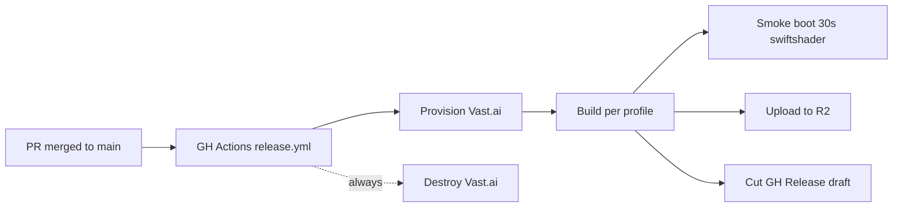

# android-oem-pipeline

> **CustomOS Device Farm** &mdash; a build pipeline that produces AOSP 16 (`android-16.0.0_r4`) Cuttlefish (`vsoc_x86_64`) images that **spoof real device identities** (Samsung Galaxy S25 Ultra in v1, more profiles to follow) for use as the targets of a cloud-hosted, GPU-accelerated Android device farm.

This repository builds the **images**. The runtime that schedules hundreds of these emulators per GPU host and exposes adb-over-tcp to external test runners is described in [`docs/device-farm.md`](docs/device-farm.md) and is intentionally not implemented in v1; the build pipeline is independently useful.

| | |
|---|---|
| **AOSP base** | `android-16.0.0_r4` |
| **Target** | Cuttlefish (`vsoc_x86_64`), `gfxstream` GPU mode |
| **v1 profile** | `galaxy-s25-ultra` (Samsung SM-S938B; fingerprint `samsung/e3qxxx/e3q:15/AP3A.240905.015.A2/S938BXXU1AYA1:user/release-keys`; advertises Android 15 / One UI 7 from an AOSP 16 base &mdash; see `docs/architecture.md`) |
| **Build host** | Vast.ai rented instance, ~32 vCPU / 64 GB / 1 TB NVMe |
| **Cold-build cost** | ~$2.50 / ~5-7 h |
| **CA injection** | v1: `/system/etc/security/cacerts/` baked at build time. v2: Conscrypt APEX rebuild (planned) |

---

## Why this exists

Apps under test routinely behave differently based on what device they think they're running on. Banking apps refuse rooted devices and known emulator fingerprints; analytics SDKs hash `BUILD_FINGERPRINT` to bucket users; ad SDKs gate on `hasSystemFeature(...)`; SafetyNet replacements check the per-partition `ro.product.*` properties for consistency. Stock Android emulators leak "this is an emulator" in dozens of places, and patching `getprop` at runtime is fragile and detectable.

The fix is to ship **a Cuttlefish image where every consumer-visible identity property is set at AOSP build time** to match a real device. Apps see the same byte sequences they'd see on actual hardware.

We additionally bake a custom root CA into `/system/etc/security/cacerts/` so the device farm runtime can stand up a per-emulator MITM proxy and decrypt TLS for traffic analytics &mdash; without that, app traffic is opaque.

## Multi-profile architecture, single source of truth

Everything that makes a build a build &mdash; AOSP branch, lunch target, branding spoof, hardware features, R2 bucket, Vast.ai sizing &mdash; lives in [`/customos.yaml`](customos.yaml). The hand-written device-tree `.mk` files stay authoritative for AOSP-internal values, but a CI parity check fails the build if `.mk` and yaml drift.

```yaml
# excerpt -- see customos.yaml for the full schema
profiles:
  - id: galaxy-s25-ultra
    enabled: true
    lunch_target: customos_cf_s25ultra-userdebug
    spoof:
      brand: samsung
      manufacturer: samsung
      model: SM-S938B
      build_fingerprint: "samsung/e3qxxx/e3q:15/AP3A.240905.015.A2/S938BXXU1AYA1:user/release-keys"
    display:
      width_px: 1440
      height_px: 3120
      density_dpi: 505
      refresh_rate_hz: 120
    hardware:
      ram_mb: 12288
      cpu_cores: 8
      features: [...] # written verbatim into a permissions XML
```

Adding a new device is: add a profile, write its `.mk`, set `enabled: true`, merge the PR. The pipeline picks it up automatically.

## CI-driven workflow (primary path)

This is the workflow you actually want.



When a PR is merged into `main`:

1. `release.yml` reads `customos.yaml` for branch / lunch / profiles / Vast sizing / R2 settings.
2. Provisions a Vast.ai instance matching `vast.cpu_min` / `ram_min_gb` / `disk_min_gb` / `dph_max_usd`.
3. `rsync`s the repo (including `customos.yaml`) to the instance, builds the Docker image there, runs `init.sh`.
4. `init.sh` iterates every `enabled: true` profile: `lunch ${lunch_target} && m -j` per profile, packaging into `out/<profile-id>/`.
5. Smoke-boot CI job downloads the artifact, boots one image under `swiftshader_indirect` for 30 s, asserts `ro.product.brand == samsung`. `continue-on-error: true` for v1 (the GH-hosted runner may lack nested KVM).
6. R2 upload (if `R2_*` secrets set) -> `<bucket>/<prefix><version>-<gitsha>/<profile-id>/<files>`.
7. Cut a **draft** GH Release with a per-profile table of fingerprints, R2 links (or attached binaries as a fallback), and SHA256SUMS.
8. Always destroy the Vast.ai instance, even on cancel/failure.

Path filters skip `docs/`, `*.md`, and `lint.yml` changes &mdash; documentation typos do not burn $2.50 of compute.

### Required secrets (already set)

| Secret | Source |
|---|---|
| `VAST_API_KEY`         | from `~/.config/vastai/vast_api_key` |
| `VAST_SSH_PRIVATE_KEY` | ed25519 keypair generated specifically for CI |
| `VAST_SSH_PUBLIC_KEY`  | matching pubkey, attached to provisioned instances |

### Optional secrets (for R2 upload)

The first build will run with R2 upload **skipped**, falling back to attaching binaries directly to the GH Release. To enable R2:

```bash
REPO=tech-sumit/android-oem-pipeline

gh secret set R2_ACCOUNT_ID        --repo "$REPO" --body "<your-cf-account-id>"
gh secret set R2_ACCESS_KEY_ID     --repo "$REPO" --body "<r2-token-access-key>"
gh secret set R2_SECRET_ACCESS_KEY --repo "$REPO" --body "<r2-token-secret>"
gh secret set R2_BUCKET            --repo "$REPO" --body "customos-aosp-builds"
```

Get the credentials from the Cloudflare dashboard:
1. R2 -> Manage R2 API Tokens -> "Create API Token", scope = "Object Read & Write" on a single bucket.
2. The token form gives you `Access Key ID` and `Secret Access Key`. Note them, you can't view the secret again.
3. `R2_ACCOUNT_ID` is on the right sidebar of the Cloudflare R2 page.

Once those four secrets are set, the next build will upload artifacts to R2 and the GH Release body will link directly to them.

## Local manual workflow (advanced / debugging)

You generally don't need this; CI does the work. It exists for two cases: debugging a build that's failing in CI without burning a fresh Vast instance per attempt, and developing a new profile before opening the PR.

```bash
# 0. one-time prerequisites
pipx install vastai
gh auth login

# 1. provision
./vast/search.sh                       # show top 5 candidate offers
./vast/provision.sh <offer_id>         # rent it; saves id to vast/.instance_id

# 2. sync + build (mounts customos.yaml at /srv/config/ in the container)
./vast/sync-source.sh
PROFILES=galaxy-s25-ultra ./vast/kick-build.sh

# 3. fetch artifacts
./vast/fetch-artifacts.sh              # rsync /srv/out/ -> ./out/<ts>/

# 4. always destroy (or pay for an idle instance)
./vast/destroy.sh
```

`PROFILES` is comma-separated; omit it to build every `enabled: true` profile in `customos.yaml`.

### Booting a built image locally

```bash
# Linux only; Cuttlefish needs KVM (won't run on Windows / macOS hosts).
sudo apt install -y google-cuttlefish-base
mkdir cf && cd cf
tar xf ../out/galaxy-s25-ultra/cvd-host_package.tar.gz
unzip ../out/galaxy-s25-ultra/galaxy-s25-ultra-img-*.zip
HOME=$PWD ./bin/launch_cvd
# In another terminal:
adb shell getprop ro.product.brand   # -> samsung
adb shell getprop ro.build.fingerprint
./scripts/verify-image.sh
```

## Layout

```text
.
├── customos.yaml          single source of truth (multi-profile schema)
├── docker/                AOSP build container (Ubuntu 22.04 + JDK 21 + ccache + repo + yq)
├── device-tree/customos/
│   └── galaxy-s25-ultra/  v1 profile - Samsung SM-S938B spoof + features XML
├── manifests/             repo local_manifests fragment (placeholder)
├── ca/                    public root CA PEMs (private keys are gitignored)
├── pipeline/              container entrypoint + per-phase hooks
│   └── hooks/             before-sync, after-sync, before-build (parity check), after-build
├── vast/                  Vast.ai lifecycle scripts
├── scripts/               gen-demo-ca, add-ca, verify-image
├── .github/workflows/     lint.yml (incl. validate-config) + release.yml (CI-driven)
└── docs/
    ├── architecture.md    pipeline architecture
    ├── device-farm.md     consumer-side runtime architecture
    ├── vast-runbook.md    cost optimization, troubleshooting
    └── conscrypt-apex.md  v2 plan: rebuild APEX with our CAs
```

## Cost guardrails

`customos.yaml`'s `vast.dph_max_usd` is a hard cap on the per-hour rate `./vast/search.sh` will accept. The default is `$0.80/hr`; a full build is roughly:

| Phase | Wall time | Cost @ $0.40/hr |
|---|---|---|
| `repo sync` (cold) | ~2 h | ~$0.80 |
| First profile `m` (cold ccache) | ~3-4 h | ~$1.20-1.60 |
| Repackage + fetch | ~30 min | ~$0.20 |
| **Cold build (1 profile)** | **~6 h** | **~$2.20-2.60** |
| Each additional profile in same run | ~30-60 min (warm ccache) | ~$0.20-0.40 |
| Subsequent incremental builds (warm ccache, same instance) | ~30 min | ~$0.20 |

`ccache` and the AOSP source live on the instance's NVMe; if you destroy the instance, the next build is cold again. To preserve them across runs, snapshot to S3/R2 (see [`docs/vast-runbook.md`](docs/vast-runbook.md#preserving-ccache-and-source-across-runs)).

## Security model

- **Private keys** (CA private keys, AOSP signing keys, Vast API key) are **never** committed. `.gitignore` and `gitleaks` enforce this.
- **Demo CA** (`ca/customos-root-ca.pem`) is committed for first-run convenience; it is public and self-signed and has no power. To use a real CA, run `./scripts/add-ca.sh /path/to/real.pem` &mdash; the public PEM gets staged into the device tree, the private key stays on your laptop.
- **Build signing** uses AOSP test keys for v0. Production should use a dedicated key set; see `docs/architecture.md#signing`.
- **CA reach** in v1 is `/system/etc/security/cacerts/`; for Android 14+ apps that explicitly use the new Conscrypt APEX trust store, see [`docs/conscrypt-apex.md`](docs/conscrypt-apex.md) for the v2 plan.

## Roadmap

- [x] v1 build pipeline + Galaxy S25 Ultra profile
- [x] CI-driven workflow with R2 + GH Release
- [x] Spoof parity lint
- [ ] First successful AOSP 16 build on Vast.ai (will fire when this PR's predecessor lands and we kick a build)
- [ ] R2 secrets + first R2-hosted release
- [ ] Conscrypt APEX rebuild
- [ ] Pixel 8 Pro profile (scaffolded; `enabled: false` in v1)
- [ ] k8s device-farm runtime ([`docs/device-farm.md`](docs/device-farm.md), separate repo)

## Acknowledgments

- [`google/android-cuttlefish`](https://github.com/google/android-cuttlefish) &mdash; the runtime we boot the produced images on.
- [`lineageos4microg/docker-lineage-cicd`](https://github.com/lineageos4microg/docker-lineage-cicd) &mdash; env-var + volume + hook contract pattern.
- [`alexanderwolz/aosp-docker`](https://github.com/alexanderwolz/aosp-docker) &mdash; clean reference for AOSP 14+ apt deps.
- [`mikefarah/yq`](https://github.com/mikefarah/yq) &mdash; YAML parsing in shell.

## License

Proprietary &mdash; see [`LICENSE`](LICENSE). The AOSP source pulled at build time remains Apache-2.0 and is **not** redistributed by this repo.
