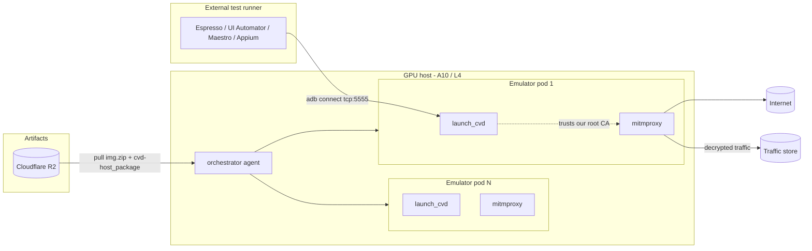
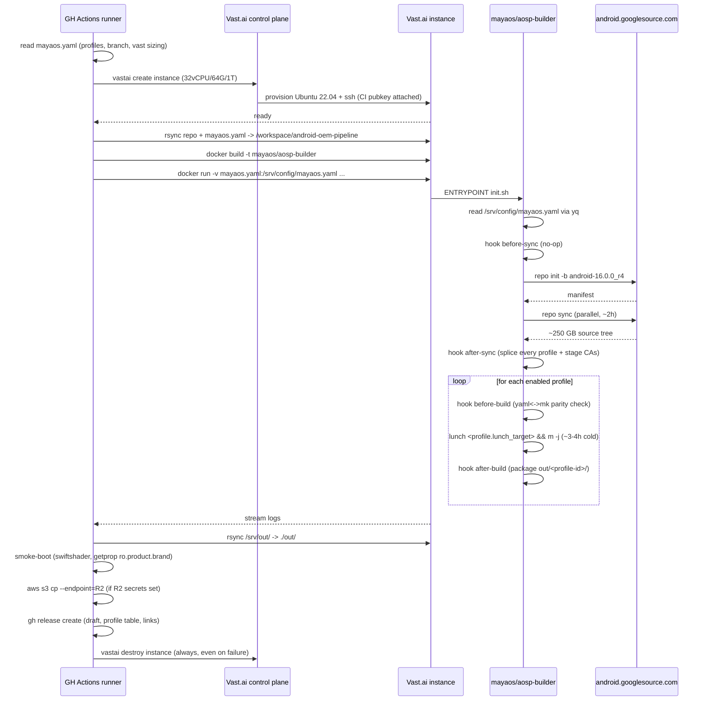

# Architecture

## Goal

Produce AOSP 16 (`android-16.0.0_r4`) Cuttlefish (`vsoc_x86_64`) images that **spoof real device identities** for use as the targets of a cloud-hosted Android device farm. v1 spoofs Samsung Galaxy S26 Ultra (SM-S948B); the schema in [`/mayaos.yaml`](../mayaos.yaml) accepts arbitrarily many profiles.

Concrete properties of every produced image:

1. **Real-device spoof** &mdash; `ro.product.{brand,manufacturer,model,name,device}` and per-partition variants overridden to byte-match the target device. `BUILD_FINGERPRINT` pinned to the real Samsung fingerprint (analytics SDKs hash this exact string).
2. **Hardware features XML** &mdash; the device "claims" cameras, fingerprint sensor, NFC, Vulkan compute, etc. as the real device does, so apps that gate on `PackageManager.hasSystemFeature(...)` see what they expect.
3. **Display geometry** &mdash; density, resolution, refresh rate driven from `mayaos.yaml` so app rendering matches the real device.
4. **Custom root CA(s)** baked into `/system/etc/security/cacerts/` so the device farm runtime's per-emulator MITM proxy can decrypt TLS for traffic analytics.
5. **Reproducible builds** via a Docker container that pins all OS-, JDK-, and `yq`-level dependencies.
6. **Cloud build economics** &mdash; ~$2-3 per cold build on rented Vast.ai compute; no local 600 GB / 64 GB RAM workstation needed.

The runtime that consumes these images (orchestrator + per-pod MITM + adb-over-tcp) is described in [`device-farm.md`](device-farm.md) and is not built by this repo.

## Build pipeline

```mermaid
flowchart LR
    subgraph Local[Control plane - GH Actions runner]
        Cfg[mayaos.yaml]
        Repo[tech-sumit/android-oem-pipeline]
        Cfg --> Repo
        Repo --> CA[ca/ - public PEMs]
        Repo --> DT[aosp-tree/ - 3-layer Waydroid split]
        Repo --> DF[docker/Dockerfile]
        Repo --> Vast[vast/*.sh]
    end
    subgraph Cloud[Vast.ai instance - 32 vCPU / 64 GB / 1 TB NVMe]
        Image[mayaos/aosp-builder<br/>Ubuntu 22.04 + AOSP deps + yq]
        Source[(/srv/src - AOSP source<br/>~250 GB)]
        Cache[(/srv/ccache - ~50 GB)]
        OutDir[(/srv/out - artifacts)]
    end
    subgraph Distribute[Artifact distribution]
        R2[(Cloudflare R2)]
        GHRel[(GH Release - draft)]
    end
    subgraph Farm[Device farm consumer - see device-farm.md]
        Orch[k8s orchestrator]
        Pods[hundreds of emulator pods]
    end

    Vast -- vastai create --> Cloud
    Vast -- rsync repo + mayaos.yaml --> Image
    Image -- repo sync --> Source
    DT -- after-sync hook --> Source
    CA -- after-sync hook --> Source
    Image -- per-profile lunch + m -j --> OutDir
    Vast -- scp --> Local
    Local -- aws s3 cp --endpoint=R2 --> R2
    Local -- gh release create --> GHRel
    R2 --> Orch
    GHRel --> Orch
    Orch --> Pods
```

## Device farm runtime (consumer of build artifacts)



Detailed density planning, resource asks per emulator, and orchestrator selection are in [`device-farm.md`](device-farm.md).


## Why this layered design

### 1. Pipeline is its own repo, AOSP source is not vendored

AOSP source is ~250 GB compressed. Vendoring it in git is impractical and pointless &mdash; it's already mirrored at `android.googlesource.com`. Our value-add is the ~50 KB device tree + scripts.

The pipeline repo therefore tracks only:

- The build container definition (`docker/Dockerfile`).
- The OEM device tree (`aosp-tree/{device,hardware,vendor}/mayaos/`).
- Public CAs to bake (`ca/`).
- Orchestration scripts (`pipeline/`, `vast/`, `scripts/`).
- Docs.

`repo sync` does the heavy lifting at build time, against fresh upstream tags.

### 2. Build orchestration is env-var driven (not config files)

Pattern stolen from `lineageos4microg/docker-lineage-cicd`. Every knob is an environment variable, defaulted in the Dockerfile, overridable at `docker run` time. This makes CI/CD trivial: a GitHub Actions workflow just passes `-e BRANCH=android-16.0.0_r4` instead of templating yaml.

The hook contract (`before-sync`, `after-sync`, `before-build`, `after-build`, `on-failure`) means downstream consumers can extend the pipeline without forking it &mdash; they just bind-mount their own hook script over `/opt/pipeline/hooks/<phase>.sh`.

### 3. The build container is unprivileged; only the test host needs KVM

A common AOSP misconception: people believe the build needs `--privileged` or `/dev/kvm`. It doesn't. `m -j` is just compilation &mdash; it runs fine in a vanilla unprivileged container. KVM is only required at *test* time when `launch_cvd` boots the resulting image.

This split means we can:

- **Build** on any Vast.ai instance (CPU-only, no KVM access required, cheaper offers eligible).
- **Test** on a separate Linux host with KVM, or an ephemeral Vast.ai instance with `--device /dev/kvm`.

### 4. Single source of truth for branding (mayaos.yaml + parity check)

`mayaos.yaml` is the contributor-facing config. The hand-written `.mk` files stay authoritative for AOSP-internal values (because rendering arbitrary AOSP build-system code from yaml is a rabbit hole). A CI parity check in `lint.yml` and a build-time parity check in `pipeline/hooks/before-build.sh` assert that every `profiles[*].spoof.{brand,manufacturer,model,build_fingerprint}` matches the corresponding `PRODUCT_*` and `BUILD_FINGERPRINT` lines in the matching `.mk`. If they drift, the build refuses to proceed.

This trades two minor edits per profile change for zero codegen, zero dynamic templating, and a `.mk` file that Android engineers can read and review without learning a new tool. v2 may revisit if the parity surface grows past ~5 keys.

### 5. CA injection: v1 system cacerts, v2 Conscrypt APEX

Android 14+ moved the runtime trust store into the Conscrypt APEX module. Anchors in `/system/etc/security/cacerts/` are still copied into the system, but per [the Conscrypt APEX docs](conscrypt-apex.md), the runtime resolver consults the APEX-bundled `/apex/com.android.conscrypt/cacerts/` first.

For v1 (this repo as committed), we drop our CA into `/system/etc/security/cacerts/`. This works for almost all apps that use the legacy KeyStore-based trust resolution and has zero impact on AOSP's APEX signing chain.

For v2 (planned, see `conscrypt-apex.md`), we'll rebuild the Conscrypt APEX with our anchors merged in, which makes our CA visible to apps that explicitly use the new APEX-resolved trust store. v2 requires also re-signing the APEX, which is more invasive.

### 6. Cloud build over local

A cold AOSP 16 build wants:

- ~250 GB free for source after `repo sync`
- ~150 GB free for `out/`
- ~50 GB for ccache
- 64 GB+ RAM (link step OOMs at 32 GB)
- 32+ vCPUs to finish in <4 h

Local Windows + WSL2 is at ~88 GB free; even a wipe-everything reset wouldn't unlock 600 GB. Vast.ai rents the right shape for ~$0.40/hr, total cold build ~$2.50, which is cheaper than buying a single SSD upgrade.

## Build phases (detailed)




## Output artifacts

After a successful build, `out/<profile-id>/` contains one set per enabled profile:

| File                          | Purpose                                                                                       |
| ----------------------------- | --------------------------------------------------------------------------------------------- |
| `<profile-id>-img-<ts>.zip`   | Cuttlefish device images (super.img, boot.img, vbmeta.img, &hellip;) ready for `launch_cvd`.  |
| `cvd-host_package.tar.gz`     | Cuttlefish host runtime (`launch_cvd`, `cvd_internal_*`, etc.) matched to this build.         |
| `build-fingerprint.txt`       | The exact `ro.build.fingerprint` of the produced image (= the spoofed fingerprint).           |
| `profile.txt`                 | Profile id, lunch target, image-zip name, build timestamp.                                    |
| `SHA256SUMS`                  | Manifest of the above.                                                                        |

To boot a specific profile (Linux + KVM only):

```bash
sudo apt install -y google-cuttlefish-base
mkdir cf && cd cf
tar xvf ../out/galaxy-s26-ultra/cvd-host_package.tar.gz
unzip ../out/galaxy-s26-ultra/galaxy-s26-ultra-img-*.zip
HOME=$PWD ./bin/launch_cvd
adb shell getprop ro.product.brand   # -> samsung
```

## Signing

v0 uses AOSP test keys (`build/make/target/product/security/testkey.x509.pem`). This is fine for development &mdash; Cuttlefish doesn't enforce verified boot. For any non-development use, generate a real signing keypair set and pass them in via `/srv/keys` (already a defined volume in the Dockerfile). See `[docs/signing.md](signing.md)` when written.

## See also

- `[docs/vast-runbook.md](vast-runbook.md)` &mdash; cost optimization, instance recipes, ccache preservation, troubleshooting.
- `[docs/conscrypt-apex.md](conscrypt-apex.md)` &mdash; v2 plan: rebuild Conscrypt APEX so the runtime trust store contains our CA.
- `[docs/adding-a-device.md](adding-a-device.md)` &mdash; how to add a second device target (e.g. real Pixel) atop this pipeline.

