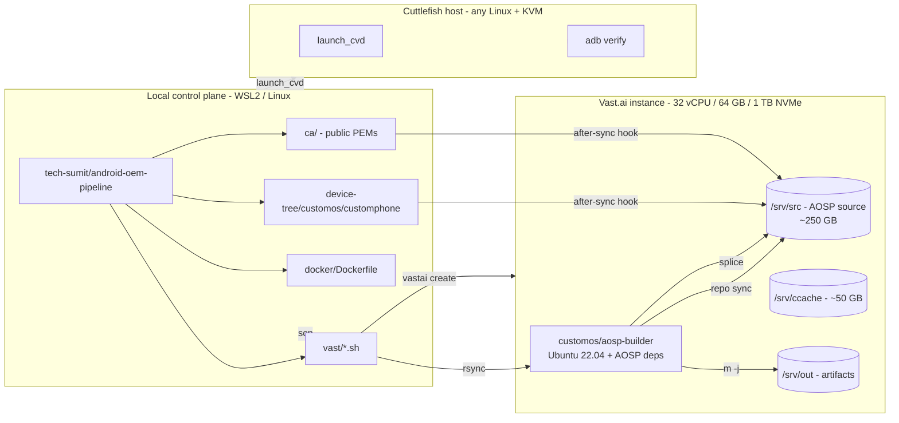
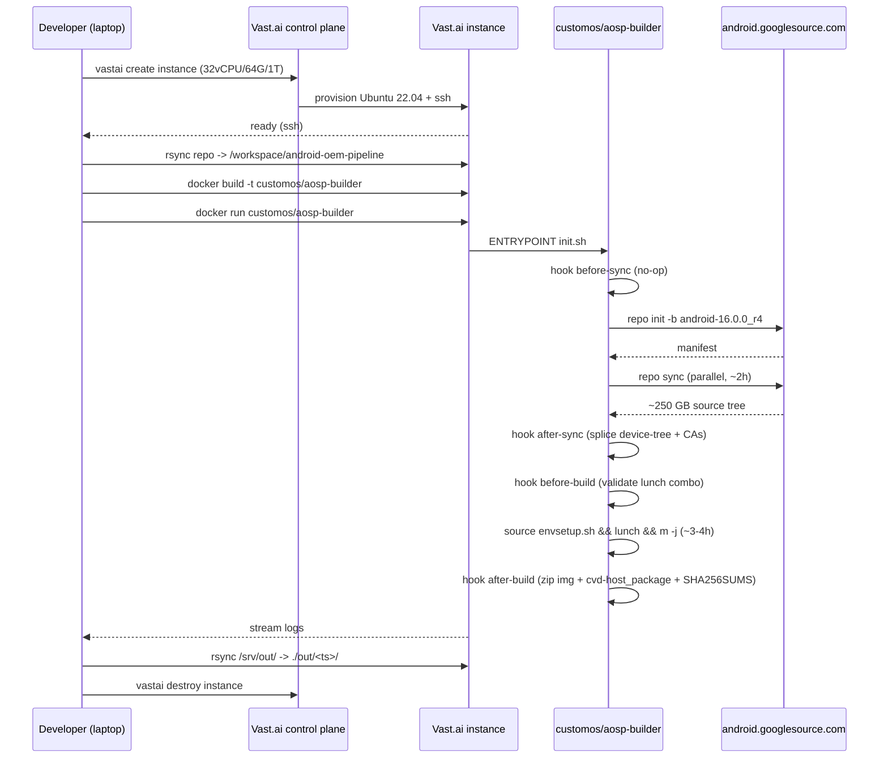

# Architecture

## Goal

Produce a custom OEM flavor of Android 16 (`android-16.0.0_r4`) targeting Cuttlefish (`vsoc_x86_64`) with:

1. **Custom branding** &mdash; `ro.product.brand = CustomOS`, `ro.oem.flavor = customos`, `ro.oem.build.tag` derived from the build date.
2. **Custom root CA(s)** baked into `/system/etc/security/cacerts/` so MITM proxies and corporate PKI work without user-trust workarounds.
3. **Reproducible builds** via a Docker container that pins all OS- and JDK-level dependencies.
4. **Cloud build economics** &mdash; ~$2-3 per cold build on rented Vast.ai compute, no local 600 GB / 64 GB RAM workstation needed.

## High-level data flow



## Why this layered design

### 1. Pipeline is its own repo, AOSP source is not vendored

AOSP source is ~250 GB compressed. Vendoring it in git is impractical and pointless &mdash; it's already mirrored at `android.googlesource.com`. Our value-add is the ~50 KB device tree + scripts.

The pipeline repo therefore tracks only:

- The build container definition (`docker/Dockerfile`).
- The OEM device tree (`device-tree/customos/customphone/`).
- Public CAs to bake (`ca/`).
- Orchestration scripts (`pipeline/`, `vast/`, `scripts/`).
- Docs.

`repo sync` does the heavy lifting at build time, against fresh upstream tags.

### 2. Build orchestration is env-var driven (not config files)

Pattern stolen from `lineageos4microg/docker-lineage-cicd`. Every knob is an environment variable, defaulted in the Dockerfile, overridable at `docker run` time. This makes CI/CD trivial: a GitHub Actions workflow just passes `-e BRANCH=android-16.0.0_r4` instead of templating yaml.

The hook contract (`before-sync`, `after-sync`, `before-build`, `after-build`, `on-failure`) means downstream consumers can extend the pipeline without forking it &mdash; they just bind-mount their own hook script over `/opt/pipeline/hooks/<phase>.sh`.

### 3. The build container is unprivileged; only the test host needs KVM

A common AOSP misconception: people believe the build needs `--privileged` or `/dev/kvm`. It doesn't. `m -j` is just compilation &mdash; it runs fine in a vanilla unprivileged container. KVM is only required at *test* time when `launch_cvd` boots the resulting image.

This split means we can:

- **Build** on any Vast.ai instance (CPU-only, no KVM access required, cheaper offers eligible).
- **Test** on a separate Linux host with KVM, or an ephemeral Vast.ai instance with `--device /dev/kvm`.

### 4. CA injection: v1 system cacerts, v2 Conscrypt APEX

Android 14+ moved the runtime trust store into the Conscrypt APEX module. Anchors in `/system/etc/security/cacerts/` are still copied into the system, but per [the Conscrypt APEX docs](conscrypt-apex.md), the runtime resolver consults the APEX-bundled `/apex/com.android.conscrypt/cacerts/` first.

For v1 (this repo as committed), we drop our CA into `/system/etc/security/cacerts/`. This works for almost all apps that use the legacy KeyStore-based trust resolution and has zero impact on AOSP's APEX signing chain.

For v2 (planned, see `conscrypt-apex.md`), we'll rebuild the Conscrypt APEX with our anchors merged in, which makes our CA visible to apps that explicitly use the new APEX-resolved trust store. v2 requires also re-signing the APEX, which is more invasive.

### 5. Cloud build over local

A cold AOSP 16 build wants:

- ~250 GB free for source after `repo sync`
- ~150 GB free for `out/`
- ~50 GB for ccache
- 64 GB+ RAM (link step OOMs at 32 GB)
- 32+ vCPUs to finish in <4 h

Local Windows + WSL2 is at ~88 GB free; even a wipe-everything reset wouldn't unlock 600 GB. Vast.ai rents the right shape for ~$0.40/hr, total cold build ~$2.50, which is cheaper than buying a single SSD upgrade.

## Build phases (detailed)



## Output artifacts

After a successful build, `out/<timestamp>/` contains:

| File | Purpose |
|---|---|
| `customos_cf_x86_64_phone-img-<ts>.zip` | Cuttlefish device images (super.img, boot.img, vbmeta.img, &hellip;) ready for `launch_cvd`. |
| `cvd-host_package.tar.gz` | Cuttlefish host runtime (`launch_cvd`, `cvd_internal_*`, virglrenderer, etc.) matched to this build. |
| `build-fingerprint.txt` | The exact `ro.build.fingerprint` of the produced image. |
| `SHA256SUMS` | Manifest of the above. |

To boot:

```bash
sudo apt install -y google-cuttlefish-base google-cuttlefish-user
mkdir cf && cd cf
tar xvf ../cvd-host_package.tar.gz
unzip ../customos_cf_x86_64_phone-img-*.zip
HOME=$PWD ./bin/launch_cvd
```

## Signing

v0 uses AOSP test keys (`build/make/target/product/security/testkey.x509.pem`). This is fine for development &mdash; Cuttlefish doesn't enforce verified boot. For any non-development use, generate a real signing keypair set and pass them in via `/srv/keys` (already a defined volume in the Dockerfile). See [`docs/signing.md`](signing.md) when written.

## See also

- [`docs/vast-runbook.md`](vast-runbook.md) &mdash; cost optimization, instance recipes, ccache preservation, troubleshooting.
- [`docs/conscrypt-apex.md`](conscrypt-apex.md) &mdash; v2 plan: rebuild Conscrypt APEX so the runtime trust store contains our CA.
- [`docs/adding-a-device.md`](adding-a-device.md) &mdash; how to add a second device target (e.g. real Pixel) atop this pipeline.
