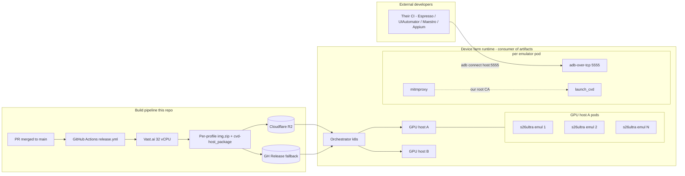
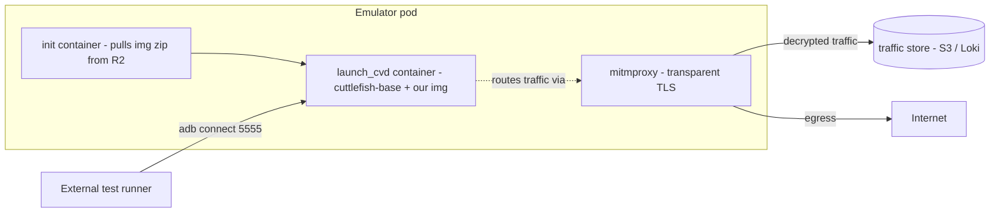

# Device Farm Architecture

> Roadmap document. v1 of this repository builds the **images**; the runtime described here is the **consumer** of those images and is intentionally not implemented in v1. The build pipeline is independently useful even before the runtime exists.

## What is the device farm?

A cloud-hosted, GPU-accelerated fleet of Android emulators that present themselves to apps under test as **real, named devices** (Samsung Galaxy S26 Ultra, Pixel 8 Pro, etc.). External developers point their CI at the farm and run UI tests against an emulator that, from the app's perspective, has the brand, model, build fingerprint, screen geometry, sensors, and feature flags of the device they care about.

Three things together make this possible:

1. **AOSP + Cuttlefish + `gfxstream`** &mdash; Google's reference virtual device for AOSP, designed for high-density emulator farms. Cuttlefish runs on a host with a real GPU (NVIDIA L4 / A10 / similar) and forwards GL/Vulkan calls via `gfxstream`, so each emulator gets near-native graphics with a fraction of the GPU memory of a full VM.
2. **Per-profile spoof** &mdash; this repository builds one Cuttlefish image per profile in `[/mayaos.yaml](../mayaos.yaml)`, with every consumer-visible identity property (`ro.product.`*, `BUILD_FINGERPRINT`, hardware features XML, density, refresh rate) overridden to match the target device.
3. **Custom root CA** &mdash; baked into `/system/etc/security/cacerts/` of every profile. The farm runs each emulator behind a per-pod MITM proxy (mitmproxy / squid / Charles); our CA is the trust anchor that lets the proxy decrypt TLS for traffic analytics and request-replay debugging.

## Reference architecture

## GPU density and resource planning

Rough planning numbers, validated against Cuttlefish's published density figures and our own back-of-envelope math. **All of these need measuring on the actual hardware before we trust them in capacity planning.**

| Resource    | Per emulator (idle)                        | Per emulator (active UI test) | A10 / L4 host (24 GB GPU mem, 32 vCPU, 128 GB RAM)             |
| ----------- | ------------------------------------------ | ----------------------------- | -------------------------------------------------------------- |
| GPU memory  | ~1.2 GB                                    | ~1.8 GB                       | ~10-12 emulators / GPU @ `gfxstream`                           |
| Host RAM    | ~1.5 GB                                    | ~2.5 GB                       | ~40-50 emulators / host (RAM-bound before GPU on smaller GPUs) |
| Host CPU    | ~0.5 vCPU idle                             | ~2 vCPU peak                  | ~10-15 emulators / host (CPU-bound during boot stampede)       |
| Disk (NVMe) | ~12 GB / emulator (image + userdata + tmp) | same                          | ~30 emulators / 1 TB disk                                      |
| Boot time   | ~30-60 s cold; ~10 s from snapshot         | &mdash;                       | &mdash;                                                        |

Real-world capacity is the **min** of those columns. On an A10 / L4 host with `gfxstream` enabled, plan for **~10 emulators per GPU**; CPU-bound the host caps at ~30 emulators/host total (two A10s, or three small instances).

`swiftshader_indirect` (software rendering) lets you fit ~30 emulators per host with no GPU at all, but at ~5 fps under load &mdash; useful for boot smoke tests, **not** for real UI tests.

## Orchestration options

We do **not** prescribe an orchestrator in v1; this repo just produces images. The realistic choices, ranked by maturity:

| Option                                                                                                                                                  | Pros                                                                                                                  | Cons                                                                                                                                           |
| ------------------------------------------------------------------------------------------------------------------------------------------------------- | --------------------------------------------------------------------------------------------------------------------- | ---------------------------------------------------------------------------------------------------------------------------------------------- |
| `[google/android-cuttlefish](https://github.com/google/android-cuttlefish)` reference orchestration (k8s manifests + `cuttlefish-orchestration` daemon) | Maintained by the Cuttlefish team. Designed exactly for this. Native gfxstream integration, working snapshot/restore. | Newer; smaller community; docs assume you know AOSP. **Recommended starting point.**                                                           |
| Build our own k8s CRD (`Emulator`) + adb-tcp `Service` per pod                                                                                          | Full control. Easy to add per-emulator MITM sidecars.                                                                 | We have to build and run it. Reinvents what cuttlefish-orchestration already does well.                                                        |
| `[OpenSTF](https://github.com/openstf/stf)`                                                                                                             | Mature web UI, screenshot streaming, manual tester workflows.                                                         | **Upstream is abandoned.** Forks exist (devicefarmer/stf) but Cuttlefish/AOSP-16 support is rough. Better suited to physical-device farms.     |
| AWS Device Farm                                                                                                                                         | Zero-ops.                                                                                                             | Proprietary, can't run our custom builds, can't inject our CA, expensive at scale. **Disqualified by the requirement to ship a custom image.** |

**Recommendation for v2:** start with `cuttlefish-orchestration` for the runtime; add a custom MITM sidecar per emulator pod (mitmproxy in transparent mode, listening on a CNI-attached interface). If that proves limiting, fork to a custom k8s CRD later.

## Per-emulator pod shape

Pod env:

- `PROFILE_ID=galaxy-s26-ultra` &mdash; init container reads this and pulls the matching `img.zip` from R2.
- `MITM_MODE=transparent` &mdash; mitmproxy started before launch_cvd; iptables routes egress through it.
- `ADB_PORT=5555` exposed via a `Service`; tests connect with `adb connect <pod-fqdn>:5555`.

## Why this design

### Cuttlefish over emulator (`-no-window`)

The Android Studio emulator (`emulator -avd ...`) was designed for developer workstations. It supports one running instance per `~/.android/avd/` folder, has lots of "feels-like-an-emulator" tells in build.prop that are hard to scrub, and doesn't snapshot/restore cleanly under k8s. Cuttlefish was designed by Google as the **CI** target &mdash; it boots faster, snapshots cleanly, runs N-per-host trivially, and (critically) lets us ship our own build that AOSP signs for us.

### Why spoof at build time, not runtime

Hooking `getprop` at runtime (Xposed, Magisk modules, etc.) is fragile and detectable. Apps that genuinely care &mdash; banking, anti-fraud SDKs, some MDM &mdash; check `BUILD_FINGERPRINT`'s exact byte sequence and cross-reference it against `system/build.prop` and the per-partition properties. The only way to pass those checks reliably is to **bake the values in at AOSP build time**, which is what this pipeline does.

### Why a custom root CA (and not just user-trust)

Android 7+ ignores user-installed CAs for app traffic by default (Network Security Config). Apps that explicitly opt in via `network_security_config.xml` will trust user CAs, but the vast majority don't &mdash; including most real-world targets we'd want to debug. System-trust (in `/system/etc/security/cacerts/`, baked into the image) is treated identically to a CA Google shipped with the device, so apps trust it without code changes.

For Android 14+ a small additional move is needed because `TrustManagerImpl` consults the Conscrypt APEX trust store first; v2 (see `[conscrypt-apex.md](conscrypt-apex.md)`) rebuilds the APEX with our anchors merged.

## Test runner integration

Every major Android test runner speaks adb-over-tcp without modification:

- **Espresso / Android instrumentation tests** &mdash; `adb connect`, `am instrument -w ...`. Identical to what AGP does locally.
- **UI Automator** &mdash; same instrumentation channel.
- **[Maestro](https://maestro.mobile.dev/)** &mdash; uses adb under the hood; `maestro --device <host:port> test ...`.
- **Appium** &mdash; UiAutomator2 driver over adb.
- `**adb shell` for manual probes** &mdash; same.

The only thing the runner sees is an Android device that happens to be on TCP/IP rather than USB.

## What v1 (this repo) ships

- One enabled profile: `**galaxy-s26-ultra`** (Samsung Galaxy S26 Ultra, SM-S948B, fingerprint `samsung/s26uxxx/s26u:16/BP1A.250505.005/S948BXXU1AYA1:user/release-keys`).
- One disabled profile scaffolded: `pixel-8-pro`. Set `enabled: true` in `mayaos.yaml` once its `.mk` is written.
- Custom CA injection (system store; APEX is v2).
- R2 + GH Release artifact distribution.
- Smoke-boot CI step that asserts `ro.product.brand == samsung` after a 30s swiftshader boot of the produced image.

## What v2+ adds

- Conscrypt APEX rebuild (`docs/conscrypt-apex.md`).
- More device profiles (`pixel-8-pro`, `iphone-equivalents-via-cf-arm`, etc.).
- The actual k8s runtime described above (separate repo).
- Per-emulator MITM sidecar with traffic capture export to S3.
- Snapshot/restore so cold boot only happens once per host per release.
- Live density measurement on the target GPU SKU.

